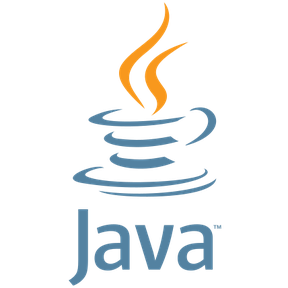
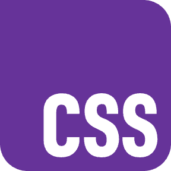
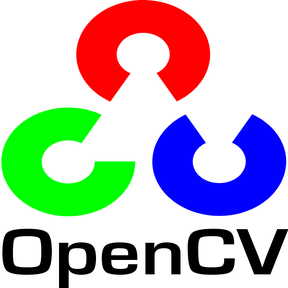
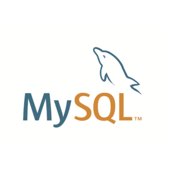
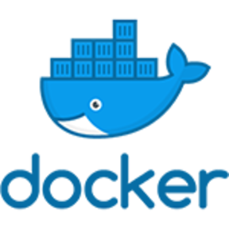
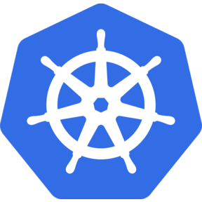
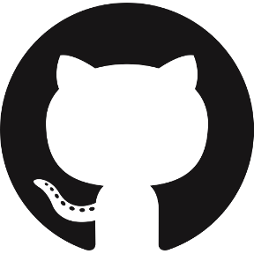
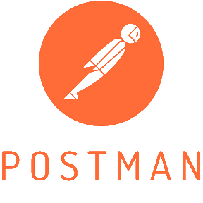

  <h1>Sri Pon Rama S</h1>
  
<b>AI & Data Science Student</b>

  
   
  

     &nbsp;&nbsp;&nbsp;
     &nbsp;&nbsp;&nbsp;
    
  

   
  
    

## Featured Systems
---

<table>
  <tr>
    <td width="50%" valign="top">
      <h4>&nbsp; <a href="https://github.com/SriPonRama/BloodLink">BloodLink</a></h4>
      
Smart blood donation & emergency request platform connecting donors, hospitals, and blood banks. Engineered with role-based access, location-aware donor matching, and efficient inventory management.

      <code>React</code> <code>Node.js</code> <code>Express</code> <code>MongoDB</code> <code>JWT</code>
    </td>
    <td width="50%" valign="top">
      <h4>&nbsp; <a href="https://github.com/SriPonRama/MediScanAI">MediScan AI</a></h4>
      
AI-assisted X-ray analysis platform using image preprocessing, feature extraction, and a rule-based inference engine for probabilistic disease recommendations.

      <code>Python</code> <code>OpenCV</code> <code>Flask</code> <code>ML</code> <code>SQL</code>
    </td>
  </tr>
  <tr>
    <td width="50%" valign="top">
      <h4>&nbsp; <a href="https://github.com/SriPonRama/Automated-Attendance-Tracking-System">Smart Attendance Tracking</a></h4>
      
AI-powered facial recognition system developed for low-resource rural school environments. Processes real-time video feeds using LBPH algorithms to log attendance automatically.

      <code>Python</code> <code>OpenCV</code> <code>Flask</code> <code>SQLite</code>
    </td>
    <td width="50%" valign="top">
      <h4>&nbsp; <a href="https://github.com/SriPonRama/rakshanet">RakshaNet</a></h4>
      
AI-powered disaster response and coordination platform integrating ML predictions with real-time response infrastructure.

      <code>MERN Stack</code> <code>Flask</code> <code>Machine Learning</code>
    </td>
  </tr>
</table>

 

## Technical Arsenal
---

<table>
  <tr>
    <td width="33%" valign="top">
      <b> Languages</b>  
      &nbsp;Python 
      &nbsp;Java 
      &nbsp;C++ 
      &nbsp;C 
      &nbsp;JavaScript 
      &nbsp;TypeScript
    </td>
    <td width="33%" valign="top">
      <b> Frontend</b>  
      &nbsp;React 
      &nbsp;HTML 
      &nbsp;CSS 
      &nbsp;Tailwind CSS
    </td>
    <td width="33%" valign="top">
      <b> Backend</b>  
      &nbsp;Node.js 
      &nbsp;Express 
      &nbsp;Flask 
      REST APIs
    </td>
  </tr>
  <tr>
    <td width="33%" valign="top">
      <b> AI / ML</b>  
      Machine Learning 
      &nbsp;OpenCV
    </td>
    <td width="33%" valign="top">
      <b> Databases</b>  
      &nbsp;MongoDB 
      &nbsp;MySQL 
      &nbsp;PostgreSQL
    </td>
    <td width="33%" valign="top">
      <b> DevOps / Cloud</b>  
      &nbsp;Docker 
      &nbsp;Kubernetes / K3s 
      &nbsp;GitLab CI/CD 
      Argo CD
    </td>
  </tr>
</table>

<b> Tools:</b> &nbsp;&nbsp; &nbsp;Git &nbsp;&nbsp; &nbsp;GitHub &nbsp;&nbsp; &nbsp;Postman

 

## Experience & DevOps Practice
---

<table>
  <tr>
    <td width="20%" valign="top"><b>2026</b></td>
    <td width="80%" valign="top">
      <b>DevOps Intern</b> 
      Orchestrated production-grade clusters using <b>Kubernetes (K3s)</b>. Containerized services with <b>Docker</b> and automated testing/deployment workflows via <b>GitLab CI/CD</b>. Implemented GitOps delivery pipelines using <b>Argo CD</b> for continuous synchronization.
    </td>
  </tr>
  <tr>
    <td width="20%" valign="top"><b>2025</b></td>
    <td width="80%" valign="top">
      <b>MERN Stack Intern</b> 
      Engineered robust, full-stack responsive web applications integrating <b>MongoDB</b>, <b>Express</b>, <b>React.js</b>, and <b>Node.js</b>. Designed modular, reusable frontend components and scalable REST APIs for authentication and business logic.
    </td>
  </tr>
</table>

 

## Algorithmic Problem Solving
---

<table>
  <tr>
    <td width="50%" valign="top">
      <b>LeetCode Profile:</b> <a href="https://leetcode.com/u/SriPonRama/">@SriPonRama</a> 
      <b>Total Solved:</b> 260 
      <b>Contest Rating:</b> 1,737 
      <b>Global Rank:</b> 607,609
    </td>
    <td width="50%" valign="top">
      <b>Problem-solving practice by language:</b> 
      Java: 114 
      C++: 99 
      C: 60 
      Python: 34
    </td>
  </tr>
</table>

 

## Selected Achievements
---

- 🥈 **Second Prize** — Project Expo 2026, Sri Eshwar College of Engineering
- 🌟 **Finalist** — InnoHack 2K26, VIT Hackathon
- 🎯 **Final Round** — Smart India Hackathon (SIH) 2025 Internals

 

## Engineering Activity
---
My daily commit history and continuous contribution timeline are visible in the native GitHub activity graph below.

---

  
<i>Constantly learning. Always shipping.</i>

